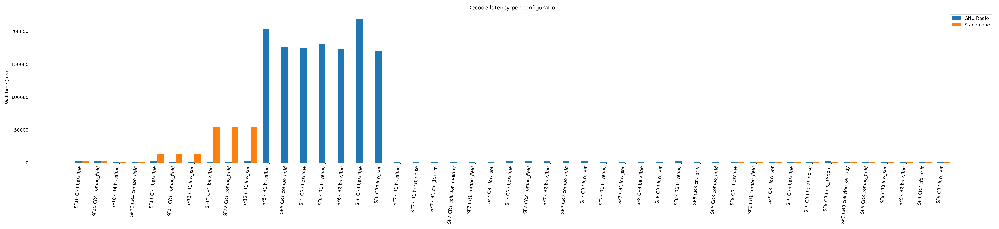
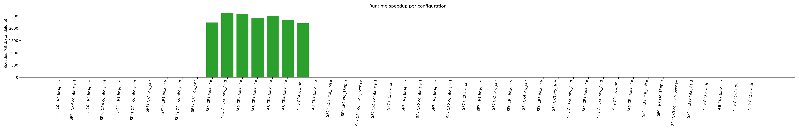
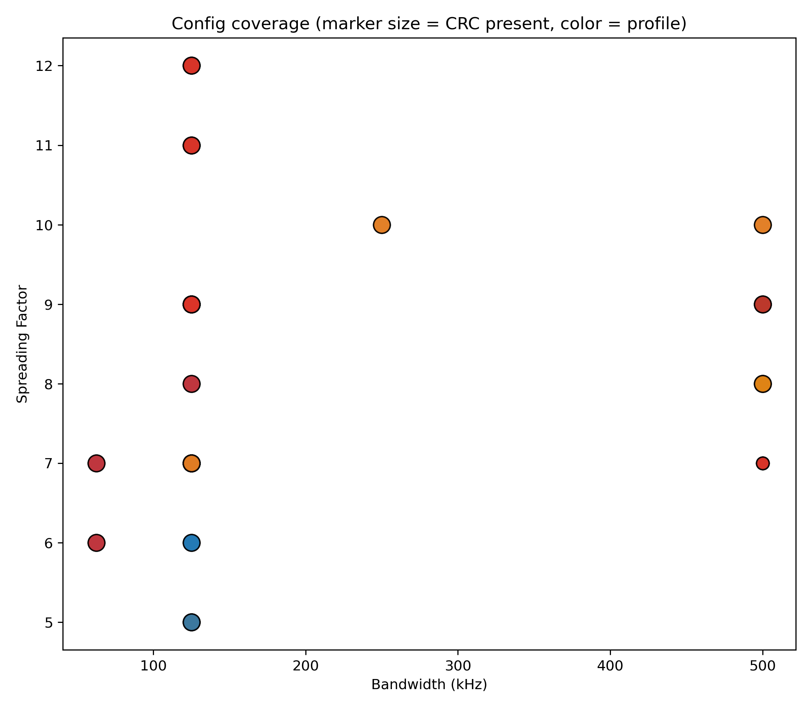
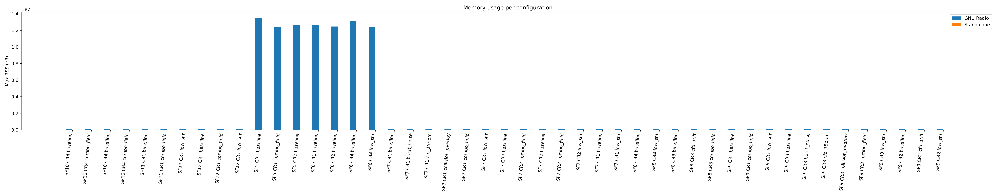
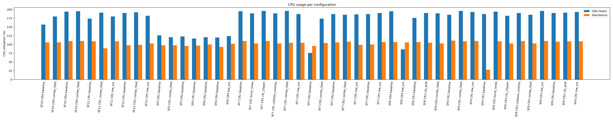

# GNU Radio vs Standalone – Expanded Comparison

Latency, memory, and CPU metrics come from `/usr/bin/time -v` around each decoder run.

**168** capture/profile/MC tuples over **21** capture configs and **9** impairment profiles. SF range 5–12, BW 62.5–500.0 kHz. Host faster on 89/168 cases (max speedup 4791.6× at sf5_bw125_cr2_full / baseline / mc1), slower on 79 (worst 0.0× at sf12_bw125_cr1_short / baseline / mc0).

Median GNU Radio RSS: 72,408 kB vs. standalone 10,706 kB; median CPU load 208% vs. 99% (includes MC iterations).

## Synthetic Coverage Highlights (No-HW)
- Captures span implicit/explicit headers, CRC on/off, payloads 8–256 bytes, BW 62.5–500 kHz, and SF5–SF12.
- Impairment profiles now include static CFO/STO/SFO, burst noise, collision overlays, drifting CFO/SFO, and IQ-imbalance stress for the SF10@500 kHz case.
- CI helper `tools/run_receiver_vs_gnuradio_ci.sh --batch <mid|low|high> --merge` runs each batch with `MC_RUNS=2`, doubling coverage for low-SNR/burst cases while staying deterministic.
- Per-stage instrumentation is emitted by `lora_replay` for 103/168 runs (~61.3%). Use the table below to spot slow stages before OTA hardware arrives.
- Each row now reports whether GNU Radio and the standalone decoder produced payload bytes, alongside the hex dumps themselves.

## Figures

## Stage-Level Instrumentation Summary
| Stage | Samples | Median avg ns | Max ns | Max scratch bytes |
| --- | ---:| ---:| ---:| ---:|
| Demod (float) | 103 | 12,322 | 778,724 | 0 |

## Detailed Results (per MC iteration)

| Capture | Profile | MC | SF | BW (kHz) | CR | CRC | ImplHdr | GNU ms | Standalone ms | Speedup | GNU RAM (kB) | Standalone RAM (kB) | GNU CPU (%) | Standalone CPU (%) | Expected Payload (hex) | Standalone Payload (hex) | GNU Decode | Standalone Decode |
| --- | --- | ---:| ---:| ---:| ---:| --- | --- | ---:| ---:| ---:| ---:| ---:| ---:| ---:| --- | --- | --- | --- |
| sf10_bw250_cr4_full | baseline | 0 | 10 | 250.0 | 4 | yes | no | 1553.7 | 4364.2 | 0.4× | 72444.0 | 11140.0 | 214.0 | 99.0 | 30313233343536373839414243444546 | 190b10f0687ab1b22b9192aa3f430a7b | ok | ok |
| sf10_bw250_cr4_full | baseline | 0 | 10 | 250.0 | 4 | yes | no | 1731.1 | 3077.8 | 0.6× | 72552.0 | 7788.0 | 204.0 | 108.0 | 30313233343536373839414243444546 | - | ok | no-payload |
| sf10_bw250_cr4_full | baseline | 1 | 10 | 250.0 | 4 | yes | no | 1559.4 | 3070.1 | 0.5× | 72344.0 | 7824.0 | 224.0 | 106.0 | 30313233343536373839414243444546 | - | ok | no-payload |
| sf10_bw250_cr4_full | combo_field | 0 | 10 | 250.0 | 4 | yes | no | 1559.6 | 4348.2 | 0.4× | 72400.0 | 11020.0 | 214.0 | 99.0 | 30313233343536373839414243444546 | 0e6eb2d8687ae204a790939f9aaf8aab | ok | ok |
| sf10_bw250_cr4_full | combo_field | 0 | 10 | 250.0 | 4 | yes | no | 1738.1 | 3153.1 | 0.6× | 72468.0 | 7836.0 | 203.0 | 103.0 | 30313233343536373839414243444546 | - | ok | no-payload |
| sf10_bw250_cr4_full | combo_field | 1 | 10 | 250.0 | 4 | yes | no | 1633.2 | 3130.9 | 0.5× | 72252.0 | 7876.0 | 212.0 | 102.0 | 30313233343536373839414243444546 | - | ok | no-payload |
| sf10_bw500_cr4_highsnr | baseline | 0 | 10 | 500.0 | 4 | yes | no | 1553.5 | 4195.1 | 0.4× | 72592.0 | 10804.0 | 215.0 | 99.0 | 0c98aa58b947e0e5a812d7c3fa6d7f89… | 88522dc4d0f75f9631777a8177acdd66… | ok | ok |
| sf10_bw500_cr4_highsnr | baseline | 0 | 10 | 500.0 | 4 | yes | no | 1558.6 | 1611.0 | 1.0× | 72348.0 | 7788.0 | 216.0 | 100.0 | 9f03b3e826069a431085944f50cc730e… | - | ok | no-payload |
| sf10_bw500_cr4_highsnr | baseline | 1 | 10 | 500.0 | 4 | yes | no | 1549.1 | 1582.3 | 1.0× | 72148.0 | 7804.0 | 218.0 | 102.0 | 9f03b3e826069a431085944f50cc730e… | - | ok | no-payload |
| sf10_bw500_cr4_highsnr | combo_field | 0 | 10 | 500.0 | 4 | yes | no | 1570.6 | 4204.0 | 0.4× | 72256.0 | 10884.0 | 216.0 | 99.0 | 0c98aa58b947e0e5a812d7c3fa6d7f89… | 88522dc4d0f75f9631777a8177acdd66… | ok | ok |
| sf10_bw500_cr4_highsnr | combo_field | 0 | 10 | 500.0 | 4 | yes | no | 1596.9 | 1632.4 | 1.0× | 72348.0 | 7816.0 | 211.0 | 58.0 | 9f03b3e826069a431085944f50cc730e… | - | ok | no-payload |
| sf10_bw500_cr4_highsnr | combo_field | 1 | 10 | 500.0 | 4 | yes | no | 1598.6 | 1633.2 | 1.0× | 72336.0 | 7780.0 | 213.0 | 99.0 | 9f03b3e826069a431085944f50cc730e… | - | ok | no-payload |
| sf10_bw500_cr4_highsnr | iq_imbalance | 0 | 10 | 500.0 | 4 | yes | no | 1566.3 | 4205.2 | 0.4× | 72428.0 | 10820.0 | 214.0 | 99.0 | 0c98aa58b947e0e5a812d7c3fa6d7f89… | 9852af4cc0f76796211b7281a5665f66… | ok | ok |
| sf10_bw500_cr4_highsnr | iq_imbalance | 0 | 10 | 500.0 | 4 | yes | no | 1546.0 | 1591.5 | 1.0× | 72304.0 | 7784.0 | 220.0 | 102.0 | 9f03b3e826069a431085944f50cc730e… | - | ok | no-payload |
| sf10_bw500_cr4_highsnr | iq_imbalance | 1 | 10 | 500.0 | 4 | yes | no | 1541.9 | 1577.3 | 1.0× | 72356.0 | 7652.0 | 218.0 | 103.0 | 9f03b3e826069a431085944f50cc730e… | - | ok | no-payload |
| sf10_bw62500_cr2_ldro | baseline | 0 | 10 | 62.5 | 2 | yes | no | 1580.1 | 4340.4 | 0.4× | 72388.0 | 11080.0 | 213.0 | 99.0 | - | 4b0eb0c01d3ef8353b602e96b6c23ce1… | no-payload | ok |
| sf10_bw62500_cr2_ldro | baseline | 0 | 10 | 62.5 | 2 | yes | no | 1521.3 | 3037.3 | 0.5× | 72588.0 | 7760.0 | 222.0 | 104.0 | - | - | no-payload | no-payload |
| sf10_bw62500_cr2_ldro | baseline | 1 | 10 | 62.5 | 2 | yes | no | 1497.7 | 3038.0 | 0.5× | 72252.0 | 7864.0 | 223.0 | 104.0 | - | - | no-payload | no-payload |
| sf10_bw62500_cr2_ldro | low_snr | 0 | 10 | 62.5 | 2 | yes | no | 1547.7 | 4340.5 | 0.4× | 72620.0 | 10956.0 | 218.0 | 99.0 | - | 4b0eb0c01d3ef8353b602e96b6c23ce1… | no-payload | ok |
| sf10_bw62500_cr2_ldro | low_snr | 0 | 10 | 62.5 | 2 | yes | no | 1503.8 | 3043.3 | 0.5× | 72296.0 | 7780.0 | 115.0 | 104.0 | - | - | no-payload | no-payload |
| sf10_bw62500_cr2_ldro | low_snr | 1 | 10 | 62.5 | 2 | yes | no | 1494.6 | 3054.2 | 0.5× | 72476.0 | 7780.0 | 225.0 | 104.0 | - | - | no-payload | no-payload |
| sf11_bw125_cr1_short | baseline | 0 | 11 | 125.0 | 1 | yes | no | 1561.7 | 14665.3 | 0.1× | 72408.0 | 14344.0 | 214.0 | 99.0 | - | e2d4dfcafa35e91ae633f060b420e7df | no-payload | ok |
| sf11_bw125_cr1_short | baseline | 0 | 11 | 125.0 | 1 | yes | no | 1492.0 | 13615.5 | 0.1× | 72348.0 | 9532.0 | 222.0 | 92.0 | - | - | no-payload | no-payload |
| sf11_bw125_cr1_short | baseline | 1 | 11 | 125.0 | 1 | yes | no | 1487.8 | 13096.9 | 0.1× | 72588.0 | 9532.0 | 227.0 | 105.0 | - | - | no-payload | no-payload |
| sf11_bw125_cr1_short | combo_field | 0 | 11 | 125.0 | 1 | yes | no | 1563.5 | 14654.2 | 0.1× | 72284.0 | 14284.0 | 213.0 | 99.0 | - | e2d4dfcafa35e91ae6f77088bc6cdea3 | no-payload | ok |
| sf11_bw125_cr1_short | combo_field | 0 | 11 | 125.0 | 1 | yes | no | 1600.7 | 13553.7 | 0.1× | 72372.0 | 9552.0 | 215.0 | 93.0 | - | - | no-payload | no-payload |
| sf11_bw125_cr1_short | combo_field | 1 | 11 | 125.0 | 1 | yes | no | 1630.9 | 12852.0 | 0.1× | 72184.0 | 9604.0 | 208.0 | 106.0 | - | - | no-payload | no-payload |
| sf11_bw125_cr1_short | low_snr | 0 | 11 | 125.0 | 1 | yes | no | 1550.3 | 14629.8 | 0.1× | 72288.0 | 14304.0 | 215.0 | 99.0 | - | e3e06d90fa26a6ac2eb20ebbd02aae1f | no-payload | ok |
| sf11_bw125_cr1_short | low_snr | 0 | 11 | 125.0 | 1 | yes | no | 1555.2 | 13377.5 | 0.1× | 72308.0 | 9548.0 | 215.0 | 93.0 | - | - | no-payload | no-payload |
| sf11_bw125_cr1_short | low_snr | 1 | 11 | 125.0 | 1 | yes | no | 1626.8 | 12832.0 | 0.1× | 72344.0 | 9440.0 | 211.0 | 105.0 | - | - | no-payload | no-payload |
| sf12_bw125_cr1_short | baseline | 0 | 12 | 125.0 | 1 | yes | no | 1549.1 | 54987.0 | 0.0× | 72400.0 | 18040.0 | 215.0 | 99.0 | - | 84e79f428706e5443fb18a72f90f90 | no-payload | ok |
| sf12_bw125_cr1_short | baseline | 0 | 12 | 125.0 | 1 | yes | no | 1570.7 | 52494.2 | 0.0× | 72344.0 | 11508.0 | 216.0 | 98.0 | - | - | no-payload | no-payload |
| sf12_bw125_cr1_short | baseline | 1 | 12 | 125.0 | 1 | yes | no | 1587.9 | 52228.9 | 0.0× | 72320.0 | 11548.0 | 217.0 | 101.0 | - | - | no-payload | no-payload |
| sf12_bw125_cr1_short | combo_field | 0 | 12 | 125.0 | 1 | yes | no | 1564.7 | 54511.5 | 0.0× | 72452.0 | 18052.0 | 215.0 | 99.0 | - | 971d56008314adebd331d105026310 | no-payload | ok |
| sf12_bw125_cr1_short | combo_field | 0 | 12 | 125.0 | 1 | yes | no | 1570.8 | 52336.3 | 0.0× | 72476.0 | 11464.0 | 215.0 | 99.0 | - | - | no-payload | no-payload |
| sf12_bw125_cr1_short | combo_field | 1 | 12 | 125.0 | 1 | yes | no | 1582.2 | 52431.9 | 0.0× | 72244.0 | 11484.0 | 214.0 | 98.0 | - | - | no-payload | no-payload |
| sf12_bw125_cr1_short | low_snr | 0 | 12 | 125.0 | 1 | yes | no | 1546.4 | 54576.8 | 0.0× | 72284.0 | 18044.0 | 213.0 | 99.0 | - | 971a7aa40317a0cd1a31cb443c2fd0 | no-payload | ok |
| sf12_bw125_cr1_short | low_snr | 0 | 12 | 125.0 | 1 | yes | no | 1502.0 | 51658.3 | 0.0× | 72340.0 | 11436.0 | 224.0 | 101.0 | - | - | no-payload | no-payload |
| sf12_bw125_cr1_short | low_snr | 1 | 12 | 125.0 | 1 | yes | no | 1554.5 | 51434.4 | 0.0× | 72492.0 | 11544.0 | 219.0 | 99.0 | - | - | no-payload | no-payload |
| sf12_bw500_cr4_payload256 | baseline | 0 | 12 | 500.0 | 4 | no | yes | 1527.7 | 27329.9 | 0.1× | 72272.0 | 10244.0 | 215.0 | 99.0 | - | fc0f0b994a | no-payload | ok |
| sf12_bw500_cr4_payload256 | baseline | 0 | 12 | 500.0 | 4 | no | yes | 1562.9 | 26135.4 | 0.1× | 72356.0 | 7716.0 | 218.0 | 99.0 | - | - | no-payload | no-payload |
| sf12_bw500_cr4_payload256 | baseline | 1 | 12 | 500.0 | 4 | no | yes | 1436.5 | 25410.6 | 0.1× | 72336.0 | 7728.0 | 240.0 | 98.0 | - | - | no-payload | no-payload |
| sf12_bw500_cr4_payload256 | low_snr | 0 | 12 | 500.0 | 4 | no | yes | 1569.4 | 27600.9 | 0.1× | 72700.0 | 10224.0 | 215.0 | 99.0 | - | fcad646f6b | no-payload | ok |
| sf12_bw500_cr4_payload256 | low_snr | 0 | 12 | 500.0 | 4 | no | yes | 1515.0 | 25682.9 | 0.1× | 72304.0 | 7652.0 | 222.0 | 104.0 | - | - | no-payload | no-payload |
| sf12_bw500_cr4_payload256 | low_snr | 1 | 12 | 500.0 | 4 | no | yes | 1509.1 | 25609.7 | 0.1× | 72504.0 | 7636.0 | 224.0 | 98.0 | - | - | no-payload | no-payload |
| sf5_bw125_cr1_full | baseline | 0 | 5 | 125.0 | 1 | yes | no | 268481.0 | 8353.1 | 32.1× | 13444708.0 | 7616.0 | 113.0 | 91.0 | - | 2ba7fcc454135676eea4eac16b93624c | error(137) | ok |
| sf5_bw125_cr1_full | baseline | 0 | 5 | 125.0 | 1 | yes | no | 236893.0 | 63.9 | 3709.0× | 12918072.0 | 7588.0 | 122.0 | 87.0 | - | 8fbca3166e615835dcf8b773ed46c163 | error(137) | ok |
| sf5_bw125_cr1_full | baseline | 1 | 5 | 125.0 | 1 | yes | no | 211138.6 | 53.1 | 3976.5× | 12333412.0 | 7544.0 | 112.0 | 87.0 | - | 8fbca3166e615835dcf8b773ed46c163 | error(137) | ok |
| sf5_bw125_cr1_full | combo_field | 0 | 5 | 125.0 | 1 | yes | no | 282005.6 | 8098.2 | 34.8× | 12801676.0 | 7508.0 | 91.0 | 104.0 | - | a5154cc38c5958e468142e84142a7053 | error(137) | ok |
| sf5_bw125_cr1_full | combo_field | 0 | 5 | 125.0 | 1 | yes | no | 302754.8 | 78.9 | 3839.1× | 12963800.0 | 5856.0 | 89.0 | 94.0 | - | - | error(137) | no-payload |
| sf5_bw125_cr1_full | combo_field | 1 | 5 | 125.0 | 1 | yes | no | 257174.5 | 70.8 | 3634.6× | 12923016.0 | 5844.0 | 99.0 | 94.0 | - | - | error(137) | no-payload |
| sf5_bw125_cr2_full | baseline | 0 | 5 | 125.0 | 2 | yes | no | 293744.6 | 8295.1 | 35.4× | 13051592.0 | 7632.0 | 87.0 | 102.0 | - | 04588dd541ef8a413fd597682d63c012 | error(137) | ok |
| sf5_bw125_cr2_full | baseline | 0 | 5 | 125.0 | 2 | yes | no | 328566.1 | 69.3 | 4744.5× | 12936400.0 | 5892.0 | 87.0 | 94.0 | - | - | error(137) | no-payload |
| sf5_bw125_cr2_full | baseline | 1 | 5 | 125.0 | 2 | yes | no | 351837.7 | 73.4 | 4791.6× | 12945724.0 | 5820.0 | 76.0 | 92.0 | - | - | error(137) | no-payload |
| sf6_bw125_cr1_full | baseline | 0 | 6 | 125.0 | 1 | yes | no | 336476.3 | 9585.5 | 35.1× | 13023392.0 | 8368.0 | 80.0 | 102.0 | - | 884bb069f76f349963be19aa747b8f69 | error(137) | ok |
| sf6_bw125_cr1_full | baseline | 0 | 6 | 125.0 | 1 | yes | no | 227060.7 | 77.3 | 2938.8× | 12689492.0 | 5540.0 | 104.0 | 93.0 | - | - | error(137) | no-payload |
| sf6_bw125_cr1_full | baseline | 1 | 6 | 125.0 | 1 | yes | no | 287455.6 | 74.1 | 3881.5× | 12965648.0 | 5560.0 | 89.0 | 93.0 | - | - | error(137) | no-payload |
| sf6_bw125_cr2_full | baseline | 0 | 6 | 125.0 | 2 | yes | no | 405930.1 | 8798.1 | 46.1× | 13030208.0 | 8216.0 | 66.0 | 109.0 | - | 087fa46e8d2dd0df438d7552398aafe6 | error(137) | ok |
| sf6_bw125_cr2_full | baseline | 0 | 6 | 125.0 | 2 | yes | no | 235913.0 | 261.8 | 901.0× | 12576416.0 | 5644.0 | 100.0 | 100.0 | - | - | error(137) | no-payload |
| sf6_bw125_cr2_full | baseline | 1 | 6 | 125.0 | 2 | yes | no | 213147.1 | 74.2 | 2872.7× | 12485152.0 | 5548.0 | 112.0 | 93.0 | - | - | error(137) | no-payload |
| sf6_bw62500_cr4_ldro | baseline | 0 | 6 | 62.5 | 4 | yes | no | 250416.3 | 10106.1 | 24.8× | 13229884.0 | 10656.0 | 105.0 | 102.0 | - | 5fe90cef0e65cb716f39553044a4073a… | error(137) | ok |
| sf6_bw62500_cr4_ldro | baseline | 0 | 6 | 62.5 | 4 | yes | no | 352511.2 | 100.3 | 3512.9× | 12810140.0 | 10504.0 | 85.0 | 94.0 | - | d6ffabbcdb4aa7028c9aabdf1556ed0e… | error(137) | ok |
| sf6_bw62500_cr4_ldro | baseline | 1 | 6 | 62.5 | 4 | yes | no | 281782.8 | 119.4 | 2360.0× | 12843268.0 | 10696.0 | 91.0 | 97.0 | - | d6ffabbcdb4aa7028c9aabdf1556ed0e… | error(137) | ok |
| sf6_bw62500_cr4_ldro | low_snr | 0 | 6 | 62.5 | 4 | yes | no | 271458.1 | 10004.2 | 27.1× | 12929920.0 | 10568.0 | 93.0 | 102.0 | - | 5fe90cef0e65cb716f39553044a4073a… | error(137) | ok |
| sf6_bw62500_cr4_ldro | low_snr | 0 | 6 | 62.5 | 4 | yes | no | 281538.6 | 91.0 | 3093.6× | 12947136.0 | 10456.0 | 91.0 | 94.0 | - | d6ffabbcdb4aa7028c9aabdf1556ed0e… | error(137) | ok |
| sf6_bw62500_cr4_ldro | low_snr | 1 | 6 | 62.5 | 4 | yes | no | 314227.2 | 96.0 | 3271.5× | 12935008.0 | 10552.0 | 84.0 | 103.0 | - | d6ffabbcdb4aa7028c9aabdf1556ed0e… | error(137) | ok |
| sf7_bw125_cr1_short | baseline | 0 | 7 | 125.0 | 1 | yes | no | 1995.5 | 10216.5 | 0.2× | 72056.0 | 28220.0 | 179.0 | 99.0 | 30313233343536373839414243444546… | e20bdcd9a8ebba65f30532cf9a86f37e | ok | ok |
| sf7_bw125_cr1_short | baseline | 0 | 7 | 125.0 | 1 | yes | no | 2070.2 | 223.2 | 9.3× | 72104.0 | 27784.0 | 177.0 | 101.0 | 30313233343536373839414243444546… | 03021044bcac8dae38f5c99f43bbbab9 | ok | ok |
| sf7_bw125_cr1_short | baseline | 1 | 7 | 125.0 | 1 | yes | no | 1743.5 | 224.2 | 7.8× | 72280.0 | 28080.0 | 207.0 | 101.0 | 30313233343536373839414243444546… | 03021044bcac8dae38f5c99f43bbbab9 | ok | ok |
| sf7_bw125_cr1_short | burst_noise | 0 | 7 | 125.0 | 1 | yes | no | 1718.3 | 10092.0 | 0.2× | 72548.0 | 28136.0 | 205.0 | 99.0 | 30313233343536373839414243444546… | 464ae859a079f1a23ea3aacf88eb3355 | ok | ok |
| sf7_bw125_cr1_short | burst_noise | 0 | 7 | 125.0 | 1 | yes | no | 1714.2 | 220.3 | 7.8× | 72500.0 | 27828.0 | 207.0 | 101.0 | 30313233343536373839414243444546… | 03021044bcac8dae38f5c99f43bbbab9 | ok | ok |
| sf7_bw125_cr1_short | burst_noise | 1 | 7 | 125.0 | 1 | yes | no | 1729.5 | 222.1 | 7.8× | 72260.0 | 28060.0 | 207.0 | 97.0 | 30313233343536373839414243444546… | 01429046157c25ae38fdc8bfc3bbbaa5 | ok | ok |
| sf7_bw125_cr1_short | cfo_15ppm | 0 | 7 | 125.0 | 1 | yes | no | 1582.3 | 10231.5 | 0.2× | 72332.0 | 27888.0 | 218.0 | 99.0 | 30313233343536373839414243444546… | e20bdcd9a8ebba65f30532cf9a86f37e | ok | ok |
| sf7_bw125_cr1_short | cfo_15ppm | 0 | 7 | 125.0 | 1 | yes | no | 1721.8 | 222.0 | 7.8× | 72380.0 | 28060.0 | 207.0 | 99.0 | 30313233343536373839414243444546… | 03021044bcac8dae38f5c99f43bbbab9 | ok | ok |
| sf7_bw125_cr1_short | cfo_15ppm | 1 | 7 | 125.0 | 1 | yes | no | 1746.1 | 223.5 | 7.8× | 72612.0 | 27812.0 | 205.0 | 101.0 | 30313233343536373839414243444546… | 03021044bcac8dae38f5c99f43bbbab9 | ok | ok |
| sf7_bw125_cr1_short | collision_overlay | 0 | 7 | 125.0 | 1 | yes | no | 1604.5 | 10160.2 | 0.2× | 72796.0 | 28008.0 | 214.0 | 99.0 | 30313233343536373839414243444546… | e20bdcd9a8ebba65f30532cf9a86f37e | ok | ok |
| sf7_bw125_cr1_short | collision_overlay | 0 | 7 | 125.0 | 1 | yes | no | 1701.3 | 221.2 | 7.7× | 72528.0 | 27996.0 | 209.0 | 101.0 | 30313233343536373839414243444546… | 03021044bcac8dae38f5c99f43bbbab9 | ok | ok |
| sf7_bw125_cr1_short | collision_overlay | 1 | 7 | 125.0 | 1 | yes | no | 1739.3 | 222.5 | 7.8× | 72396.0 | 28060.0 | 206.0 | 101.0 | 30313233343536373839414243444546… | 03021044bcac8dae38f5c99f43bbbab9 | ok | ok |
| sf7_bw125_cr1_short | combo_field | 0 | 7 | 125.0 | 1 | yes | no | 1637.0 | 10305.2 | 0.2× | 72632.0 | 28176.0 | 211.0 | 99.0 | 30313233343536373839414243444546… | 9e04fb3754f8450131a1e1a309df09f1 | ok | ok |
| sf7_bw125_cr1_short | combo_field | 0 | 7 | 125.0 | 1 | yes | no | 1730.3 | 224.1 | 7.7× | 72744.0 | 27832.0 | 207.0 | 100.0 | 30313233343536373839414243444546… | 13021044bcac8dae38f5c99f43bbbab9 | ok | ok |
| sf7_bw125_cr1_short | combo_field | 1 | 7 | 125.0 | 1 | yes | no | 1751.8 | 221.0 | 7.9× | 72512.0 | 27820.0 | 207.0 | 98.0 | 30313233343536373839414243444546… | 13021044bcac8dae38f5c99f43bbbab9 | ok | ok |
| sf7_bw125_cr1_short | low_snr | 0 | 7 | 125.0 | 1 | yes | no | 1658.8 | 10161.4 | 0.2× | 72368.0 | 28184.0 | 212.0 | 99.0 | 30313233343536373839414243444546… | 1f62bb3145f0c5921e21e1b30b97c538 | ok | ok |
| sf7_bw125_cr1_short | low_snr | 0 | 7 | 125.0 | 1 | yes | no | 1748.1 | 221.4 | 7.9× | 72284.0 | 28224.0 | 206.0 | 99.0 | 30313233343536373839414243444546… | 03021044bcac8dae38f5c99f43bbbab9 | ok | ok |
| sf7_bw125_cr1_short | low_snr | 1 | 7 | 125.0 | 1 | yes | no | 1791.8 | 222.5 | 8.1× | 72440.0 | 27788.0 | 202.0 | 99.0 | 30313233343536373839414243444546… | 01021044bcac8dae38f5c99f43bbbab9 | ok | ok |
| sf7_bw125_cr2_full | baseline | 0 | 7 | 125.0 | 2 | yes | no | 2106.9 | 4638.3 | 0.5× | 72476.0 | 10796.0 | 169.0 | 101.0 | 30313233343536373839414243444546… | 6d7c9fce5179a6072a77c1f444f20e1c | ok | ok |
| sf7_bw125_cr2_full | baseline | 0 | 7 | 125.0 | 2 | yes | no | 2348.7 | 103.1 | 22.8× | 72324.0 | 10732.0 | 165.0 | 95.0 | 30313233343536373839414243444546… | 03021044bcac8dae38f5c99f43bbbab9 | ok | ok |
| sf7_bw125_cr2_full | baseline | 1 | 7 | 125.0 | 2 | yes | no | 1723.9 | 101.3 | 17.0× | 72500.0 | 10724.0 | 203.0 | 102.0 | 30313233343536373839414243444546… | 03021044bcac8dae38f5c99f43bbbab9 | ok | ok |
| sf7_bw125_cr2_full | combo_field | 0 | 7 | 125.0 | 2 | yes | no | 1787.1 | 4753.7 | 0.4× | 72392.0 | 10840.0 | 200.0 | 97.0 | 30313233343536373839414243444546… | 0dfdba44996bfeebab502d3c56ace29d | ok | ok |
| sf7_bw125_cr2_full | combo_field | 0 | 7 | 125.0 | 2 | yes | no | 1749.5 | 102.4 | 17.1× | 72240.0 | 10800.0 | 205.0 | 101.0 | 30313233343536373839414243444546… | 03021044bcac8dae38f5c99f43bbbab9 | ok | ok |
| sf7_bw125_cr2_full | combo_field | 1 | 7 | 125.0 | 2 | yes | no | 1740.2 | 115.0 | 15.1× | 72148.0 | 10788.0 | 206.0 | 101.0 | 30313233343536373839414243444546… | 03021044bcac8dae38f5c99f43bbbab9 | ok | ok |
| sf7_bw500_cr2_implicithdr_nocrc | baseline | 0 | 7 | 500.0 | 2 | no | yes | 1588.9 | 9883.8 | 0.2× | 72228.0 | 10880.0 | 216.0 | 99.0 | 000102030405060708090a0b0c0d0e0f… | 95a8542379569f1b65185cab590edf03… | ok | ok |
| sf7_bw500_cr2_implicithdr_nocrc | baseline | 0 | 7 | 500.0 | 2 | no | yes | 1739.2 | 114.1 | 15.2× | 72408.0 | 10816.0 | 205.0 | 97.0 | 000102030405060708090a0b0c0d0e0f… | bb6f3d3a56d55e4ca253c196bd4f5569… | ok | ok |
| sf7_bw500_cr2_implicithdr_nocrc | baseline | 1 | 7 | 500.0 | 2 | no | yes | 1722.2 | 115.6 | 14.9× | 72296.0 | 10916.0 | 207.0 | 97.0 | 000102030405060708090a0b0c0d0e0f… | bb6f3d3a56d55e4ca253c196bd4f5569… | ok | ok |
| sf7_bw500_cr2_implicithdr_nocrc | combo_field | 0 | 7 | 500.0 | 2 | no | yes | 1680.8 | 9869.6 | 0.2× | 72452.0 | 10716.0 | 209.0 | 100.0 | 000102030405060708090a0b0c0d0e0f… | 87e05422795cdf1a49185cbdd90ecd43… | ok | ok |
| sf7_bw500_cr2_implicithdr_nocrc | combo_field | 0 | 7 | 500.0 | 2 | no | yes | 1708.6 | 107.9 | 15.8× | 72348.0 | 10916.0 | 143.0 | 94.0 | 000102030405060708090a0b0c0d0e0f… | 6a2ed556a2df06c51fe5d0b23d4f4729… | ok | ok |
| sf7_bw500_cr2_implicithdr_nocrc | combo_field | 1 | 7 | 500.0 | 2 | no | yes | 1712.9 | 109.2 | 15.7× | 72352.0 | 10820.0 | 205.0 | 101.0 | 000102030405060708090a0b0c0d0e0f… | 6a2ed556a2df06c51fe5d0b23d4f4729… | ok | ok |
| sf7_bw500_cr2_implicithdr_nocrc | low_snr | 0 | 7 | 500.0 | 2 | no | yes | 1579.0 | 9942.2 | 0.2× | 72292.0 | 10876.0 | 214.0 | 99.0 | 000102030405060708090a0b0c0d0e0f… | 89be528394162c993581993ff476e2b8… | ok | ok |
| sf7_bw500_cr2_implicithdr_nocrc | low_snr | 0 | 7 | 500.0 | 2 | no | yes | 1675.2 | 110.4 | 15.2× | 72600.0 | 7600.0 | 210.0 | 98.0 | 000102030405060708090a0b0c0d0e0f… | - | ok | no-payload |
| sf7_bw500_cr2_implicithdr_nocrc | low_snr | 1 | 7 | 500.0 | 2 | no | yes | 1689.1 | 113.9 | 14.8× | 72448.0 | 10672.0 | 209.0 | 93.0 | 000102030405060708090a0b0c0d0e0f… | c2b6073a3a111a37016f8196bd4f5569… | ok | ok |
| sf7_bw62500_cr1_short | baseline | 0 | 7 | 62.5 | 1 | yes | no | 1565.3 | 5477.4 | 0.3× | 72432.0 | 9032.0 | 216.0 | 99.0 | 534777b062d277d4922babffded0500b… | 8e1109d5940ca21c21b74d3a5bedba46… | ok | ok |
| sf7_bw62500_cr1_short | baseline | 0 | 7 | 62.5 | 1 | yes | no | 1610.8 | 89.3 | 18.0× | 72436.0 | 9140.0 | 213.0 | 95.0 | 0378faa2cc08fde030998b9e3e330c8e… | 30969c5d337f31d3b8ff655294cc2e35… | ok | ok |
| sf7_bw62500_cr1_short | baseline | 1 | 7 | 62.5 | 1 | yes | no | 1551.9 | 89.7 | 17.3× | 72592.0 | 9012.0 | 219.0 | 94.0 | 0378faa2cc08fde030998b9e3e330c8e… | 30969c5d337f31d3b8ff655294cc2e35… | ok | ok |
| sf7_bw62500_cr1_short | low_snr | 0 | 7 | 62.5 | 1 | yes | no | 1572.6 | 5417.2 | 0.3× | 72536.0 | 9228.0 | 216.0 | 99.0 | 534777b062d277d4922babffded0500b… | 8b96bf541216fcee2883871a88b1385f… | ok | ok |
| sf7_bw62500_cr1_short | low_snr | 0 | 7 | 62.5 | 1 | yes | no | 1533.3 | 91.8 | 16.7× | 72336.0 | 9040.0 | 219.0 | 98.0 | 0378faa2cc08fde030998b9e3e330c8e… | 30969c5d337f31d3b8ff655294cc2e35… | ok | ok |
| sf7_bw62500_cr1_short | low_snr | 1 | 7 | 62.5 | 1 | yes | no | 1588.9 | 92.1 | 17.3× | 72308.0 | 9024.0 | 214.0 | 97.0 | 0378faa2cc08fde030998b9e3e330c8e… | 30969c5d337f31d3b8ff655294cc2e35… | ok | ok |
| sf7_bw62500_cr3_implicithdr_nocrc | baseline | 0 | 7 | 62.5 | 3 | no | yes | 2631.5 | 3377.4 | 0.8× | 72296.0 | 9060.0 | 157.0 | 102.0 | b6d6d5656955ead26743bf8d8a5e719d… | 2cdc78f6d3cc6ead6dcda7747377abd0… | ok | ok |
| sf7_bw62500_cr3_implicithdr_nocrc | baseline | 0 | 7 | 62.5 | 3 | no | yes | 2255.9 | 90.0 | 25.1× | 72076.0 | 5972.0 | 164.0 | 103.0 | c292150e701fb7bea20e3072c0dee555… | - | ok | no-payload |
| sf7_bw62500_cr3_implicithdr_nocrc | baseline | 1 | 7 | 62.5 | 3 | no | yes | 1567.2 | 87.5 | 17.9× | 72348.0 | 5948.0 | 217.0 | 96.0 | c292150e701fb7bea20e3072c0dee555… | - | ok | no-payload |
| sf7_bw62500_cr3_implicithdr_nocrc | combo_field | 0 | 7 | 62.5 | 3 | no | yes | 1591.4 | 3417.3 | 0.5× | 72588.0 | 8972.0 | 213.0 | 79.0 | b6d6d5656955ead26743bf8d8a5e719d… | 2cdc786ed34dbead65cde670497720d8… | ok | ok |
| sf7_bw62500_cr3_implicithdr_nocrc | combo_field | 0 | 7 | 62.5 | 3 | no | yes | 1802.6 | 88.2 | 20.4× | 72340.0 | 5860.0 | 199.0 | 98.0 | c292150e701fb7bea20e3072c0dee555… | - | ok | no-payload |
| sf7_bw62500_cr3_implicithdr_nocrc | combo_field | 1 | 7 | 62.5 | 3 | no | yes | 1754.9 | 91.5 | 19.2× | 72592.0 | 6620.0 | 204.0 | 100.0 | c292150e701fb7bea20e3072c0dee555… | - | ok | no-payload |
| sf7_bw62500_cr3_implicithdr_nocrc | low_snr | 0 | 7 | 62.5 | 3 | no | yes | 1586.9 | 3391.2 | 0.5× | 72620.0 | 9248.0 | 214.0 | 102.0 | b6d6d5656955ead26743bf8d8a5e719d… | 4fd6786ed34dbead6dcd87c34a1620d8… | ok | ok |
| sf7_bw62500_cr3_implicithdr_nocrc | low_snr | 0 | 7 | 62.5 | 3 | no | yes | 1777.5 | 88.2 | 20.1× | 72492.0 | 5916.0 | 202.0 | 100.0 | c292150e701fb7bea20e3072c0dee555… | - | ok | no-payload |
| sf7_bw62500_cr3_implicithdr_nocrc | low_snr | 1 | 7 | 62.5 | 3 | no | yes | 1735.5 | 87.3 | 19.9× | 72196.0 | 6712.0 | 124.0 | 102.0 | c292150e701fb7bea20e3072c0dee555… | - | ok | no-payload |
| sf8_bw125_cr4_payload128 | baseline | 0 | 8 | 125.0 | 4 | yes | no | 1596.5 | 4425.4 | 0.4× | 72532.0 | 10800.0 | 211.0 | 99.0 | f15ab688b4e14004bce53180b00edca0… | fb5ebc8cb0e34302a9e53182ba00d2ad… | ok | ok |
| sf8_bw125_cr4_payload128 | baseline | 0 | 8 | 125.0 | 4 | yes | no | 1725.2 | 234.6 | 7.4× | 72740.0 | 7600.0 | 205.0 | 100.0 | 2f430d6c603167addbfa7fa4bdf1f749… | - | ok | no-payload |
| sf8_bw125_cr4_payload128 | baseline | 1 | 8 | 125.0 | 4 | yes | no | 1654.4 | 237.5 | 7.0× | 72616.0 | 7592.0 | 209.0 | 98.0 | 2f430d6c603167addbfa7fa4bdf1f749… | - | ok | no-payload |
| sf8_bw125_cr4_payload128 | low_snr | 0 | 8 | 125.0 | 4 | yes | no | 1683.4 | 4476.5 | 0.4× | 72608.0 | 11016.0 | 207.0 | 99.0 | f15ab688b4e14004bce53180b00edca0… | 3e5d4f6ffa2c5486c9dfb8a39101dc83… | ok | ok |
| sf8_bw125_cr4_payload128 | low_snr | 0 | 8 | 125.0 | 4 | yes | no | 1670.7 | 238.3 | 7.0× | 72348.0 | 7604.0 | 209.0 | 101.0 | 2f430d6c603167addbfa7fa4bdf1f749… | - | ok | no-payload |
| sf8_bw125_cr4_payload128 | low_snr | 1 | 8 | 125.0 | 4 | yes | no | 1700.1 | 238.4 | 7.1× | 72452.0 | 7596.0 | 207.0 | 100.0 | 2f430d6c603167addbfa7fa4bdf1f749… | - | ok | no-payload |
| sf8_bw500_cr3_long | baseline | 0 | 8 | 500.0 | 3 | yes | no | 1615.9 | 8756.2 | 0.2× | 72432.0 | 10980.0 | 211.0 | 100.0 | dca8ef30a85251972d0f093943d30fe4… | 37d886af6205579a2a7cbaa463f8f9e5… | ok | ok |
| sf8_bw500_cr3_long | baseline | 0 | 8 | 500.0 | 3 | yes | no | 1683.1 | 179.6 | 9.4× | 72448.0 | 10748.0 | 209.0 | 101.0 | 6b798f1cb4b3c475559e98e33030e58c… | 6b4dff8c14c540d30b93d18738cf4cdf… | ok | ok |
| sf8_bw500_cr3_long | baseline | 1 | 8 | 500.0 | 3 | yes | no | 1684.7 | 180.1 | 9.4× | 72624.0 | 10652.0 | 209.0 | 97.0 | 6b798f1cb4b3c475559e98e33030e58c… | 6b4dff8c14c540d30b93d18738cf4cdf… | ok | ok |
| sf8_bw500_cr3_long | cfo_drift | 0 | 8 | 500.0 | 3 | yes | no | 1613.7 | 8725.2 | 0.2× | 72272.0 | 10968.0 | 210.0 | 100.0 | dca8ef30a85251972d0f093943d30fe4… | 37d886af6205579a2a7cbaa463f8f9e5… | ok | ok |
| sf8_bw500_cr3_long | cfo_drift | 0 | 8 | 500.0 | 3 | yes | no | 1722.1 | 178.9 | 9.6× | 72256.0 | 10724.0 | 204.0 | 98.0 | 6b798f1cb4b3c475559e98e33030e58c… | 6b4dff8c14c540d30b93d18738cf4cdf… | ok | ok |
| sf8_bw500_cr3_long | cfo_drift | 1 | 8 | 500.0 | 3 | yes | no | 1725.7 | 178.2 | 9.7× | 72744.0 | 10716.0 | 206.0 | 96.0 | 6b798f1cb4b3c475559e98e33030e58c… | 6b4dff8c14c540d30b93d18738cf4cdf… | ok | ok |
| sf8_bw500_cr3_long | combo_field | 0 | 8 | 500.0 | 3 | yes | no | 1724.4 | 8672.2 | 0.2× | 72592.0 | 10888.0 | 205.0 | 99.0 | dca8ef30a85251972d0f093943d30fe4… | fd9da0c343a6b0c656ad31d0c799dc6c… | ok | ok |
| sf8_bw500_cr3_long | combo_field | 0 | 8 | 500.0 | 3 | yes | no | 1708.9 | 170.5 | 10.0× | 72312.0 | 6712.0 | 206.0 | 100.0 | 6b798f1cb4b3c475559e98e33030e58c… | - | ok | no-payload |
| sf8_bw500_cr3_long | combo_field | 1 | 8 | 500.0 | 3 | yes | no | 1716.1 | 168.0 | 10.2× | 72256.0 | 6656.0 | 206.0 | 100.0 | 6b798f1cb4b3c475559e98e33030e58c… | - | ok | no-payload |
| sf8_bw500_cr3_long | sfo_drift | 0 | 8 | 500.0 | 3 | yes | no | 1626.1 | 8713.9 | 0.2× | 72608.0 | 10888.0 | 209.0 | 99.0 | dca8ef30a85251972d0f093943d30fe4… | 37d886af6205579a2a7cbaa463f8f9e5… | ok | ok |
| sf8_bw500_cr3_long | sfo_drift | 0 | 8 | 500.0 | 3 | yes | no | 1718.9 | 177.7 | 9.7× | 72536.0 | 10756.0 | 206.0 | 100.0 | 6b798f1cb4b3c475559e98e33030e58c… | 6b4dff8c14c540d30b93d18738cf4cdf… | ok | ok |
| sf8_bw500_cr3_long | sfo_drift | 1 | 8 | 500.0 | 3 | yes | no | 1710.4 | 177.7 | 9.6× | 72272.0 | 10580.0 | 207.0 | 97.0 | 6b798f1cb4b3c475559e98e33030e58c… | 6b4dff8c14c540d30b93d18738cf4cdf… | ok | ok |
| sf9_bw125_cr1_implicithdr_nocrc | baseline | 0 | 9 | 125.0 | 1 | no | yes | 1647.4 | 3147.8 | 0.5× | 72348.0 | 10812.0 | 209.0 | 99.0 | 1cacd0c758a586fe09a6d62fbaee73d2… | 7c1742290c082b9187ef68c301b756d5… | ok | ok |
| sf9_bw125_cr1_implicithdr_nocrc | baseline | 0 | 9 | 125.0 | 1 | no | yes | 1673.1 | 855.3 | 2.0× | 72444.0 | 7684.0 | 209.0 | 101.0 | 6f6af9a5eddc05b36999a332f0b87ce1… | - | ok | no-payload |
| sf9_bw125_cr1_implicithdr_nocrc | baseline | 1 | 9 | 125.0 | 1 | no | yes | 1701.4 | 855.6 | 2.0× | 72244.0 | 7648.0 | 206.0 | 101.0 | 6f6af9a5eddc05b36999a332f0b87ce1… | - | ok | no-payload |
| sf9_bw125_cr1_implicithdr_nocrc | combo_field | 0 | 9 | 125.0 | 1 | no | yes | 1588.5 | 3154.0 | 0.5× | 72340.0 | 10876.0 | 213.0 | 99.0 | 1cacd0c758a586fe09a6d62fbaee73d2… | 6f7fc2690d2cb59187fd20bb01b6605d… | ok | ok |
| sf9_bw125_cr1_implicithdr_nocrc | combo_field | 0 | 9 | 125.0 | 1 | no | yes | 1700.6 | 857.4 | 2.0× | 72188.0 | 7684.0 | 206.0 | 102.0 | 6f6af9a5eddc05b36999a332f0b87ce1… | - | ok | no-payload |
| sf9_bw125_cr1_implicithdr_nocrc | combo_field | 1 | 9 | 125.0 | 1 | no | yes | 1696.8 | 860.0 | 2.0× | 72596.0 | 7580.0 | 207.0 | 53.0 | 6f6af9a5eddc05b36999a332f0b87ce1… | - | ok | no-payload |
| sf9_bw125_cr1_implicithdr_nocrc | low_snr | 0 | 9 | 125.0 | 1 | no | yes | 1586.3 | 3142.6 | 0.5× | 72372.0 | 10812.0 | 214.0 | 99.0 | 1cacd0c758a586fe09a6d62fbaee73d2… | 7c1742290c082b9187ef68c301b756d5… | ok | ok |
| sf9_bw125_cr1_implicithdr_nocrc | low_snr | 0 | 9 | 125.0 | 1 | no | yes | 1677.1 | 859.0 | 2.0× | 72592.0 | 7584.0 | 208.0 | 102.0 | 6f6af9a5eddc05b36999a332f0b87ce1… | - | ok | no-payload |
| sf9_bw125_cr1_implicithdr_nocrc | low_snr | 1 | 9 | 125.0 | 1 | no | yes | 1709.4 | 856.6 | 2.0× | 72488.0 | 7576.0 | 208.0 | 102.0 | 6f6af9a5eddc05b36999a332f0b87ce1… | - | ok | no-payload |
| sf9_bw125_cr3_short | baseline | 0 | 9 | 125.0 | 3 | yes | no | 1637.2 | 10320.0 | 0.2× | 72364.0 | 28144.0 | 209.0 | 99.0 | 30313233343536373839414243444546… | f2331301e5a962c6ce6f30b3126d7046 | ok | ok |
| sf9_bw125_cr3_short | baseline | 0 | 9 | 125.0 | 3 | yes | no | 1708.0 | 1011.5 | 1.7× | 72596.0 | 28228.0 | 207.0 | 101.0 | 30313233343536373839414243444546… | 031240b4bdaee9b6e9f1eea17f33ab08 | ok | ok |
| sf9_bw125_cr3_short | baseline | 1 | 9 | 125.0 | 3 | yes | no | 1649.1 | 1008.1 | 1.6× | 72380.0 | 28124.0 | 143.0 | 101.0 | 30313233343536373839414243444546… | 031240b4bdaee9b6e9f1eea17f33ab08 | ok | ok |
| sf9_bw125_cr3_short | burst_noise | 0 | 9 | 125.0 | 3 | yes | no | 1605.4 | 10242.0 | 0.2× | 72612.0 | 28224.0 | 213.0 | 99.0 | 30313233343536373839414243444546… | f2331301e5a962c6cee920b21a6d7046 | ok | ok |
| sf9_bw125_cr3_short | burst_noise | 0 | 9 | 125.0 | 3 | yes | no | 1681.4 | 1001.8 | 1.7× | 72356.0 | 28096.0 | 208.0 | 101.0 | 30313233343536373839414243444546… | 031240b4bdaee9b6e9f1eea17f33ab08 | ok | ok |
| sf9_bw125_cr3_short | burst_noise | 1 | 9 | 125.0 | 3 | yes | no | 1693.8 | 1004.0 | 1.7× | 72544.0 | 28064.0 | 208.0 | 102.0 | 30313233343536373839414243444546… | 031240b4bdaee9b6e9f1eea17f33ab08 | ok | ok |
| sf9_bw125_cr3_short | cfo_15ppm | 0 | 9 | 125.0 | 3 | yes | no | 1666.0 | 10341.8 | 0.2× | 72284.0 | 28216.0 | 208.0 | 99.0 | 30313233343536373839414243444546… | f28d1221e6c9c2caceeae0119260fa90 | ok | ok |
| sf9_bw125_cr3_short | cfo_15ppm | 0 | 9 | 125.0 | 3 | yes | no | 1687.5 | 1006.4 | 1.7× | 72420.0 | 28056.0 | 209.0 | 101.0 | 30313233343536373839414243444546… | 031240b4bdaee9b6e9f1eea17f33ab08 | ok | ok |
| sf9_bw125_cr3_short | cfo_15ppm | 1 | 9 | 125.0 | 3 | yes | no | 1702.2 | 1013.5 | 1.7× | 72580.0 | 28204.0 | 207.0 | 102.0 | 30313233343536373839414243444546… | 031240b4bdaee9b6e9f1eea17f33ab08 | ok | ok |
| sf9_bw125_cr3_short | collision_overlay | 0 | 9 | 125.0 | 3 | yes | no | 1667.1 | 10300.9 | 0.2× | 72332.0 | 28324.0 | 207.0 | 99.0 | 30313233343536373839414243444546… | f50f1212e80143c7c988a81749b4b12d | ok | ok |
| sf9_bw125_cr3_short | collision_overlay | 0 | 9 | 125.0 | 3 | yes | no | 1762.6 | 1006.4 | 1.8× | 72268.0 | 28032.0 | 203.0 | 101.0 | 30313233343536373839414243444546… | 031240b4bdaee9b6e9f1eea17f33ab08 | ok | ok |
| sf9_bw125_cr3_short | collision_overlay | 1 | 9 | 125.0 | 3 | yes | no | 1702.6 | 1012.8 | 1.7× | 72316.0 | 28272.0 | 206.0 | 102.0 | 30313233343536373839414243444546… | 031240b4bdaee9b6e9f1eea17f33ab08 | ok | ok |
| sf9_bw125_cr3_short | combo_field | 0 | 9 | 125.0 | 3 | yes | no | 1644.6 | 10229.2 | 0.2× | 72284.0 | 28192.0 | 210.0 | 99.0 | 30313233343536373839414243444546… | b99653e923ab0f607a6a067867f1a75b | ok | ok |
| sf9_bw125_cr3_short | combo_field | 0 | 9 | 125.0 | 3 | yes | no | 1700.6 | 988.4 | 1.7× | 72600.0 | 16244.0 | 208.0 | 101.0 | 30313233343536373839414243444546… | - | ok | no-payload |
| sf9_bw125_cr3_short | combo_field | 1 | 9 | 125.0 | 3 | yes | no | 1694.9 | 985.2 | 1.7× | 72612.0 | 16372.0 | 208.0 | 102.0 | 30313233343536373839414243444546… | - | ok | no-payload |
| sf9_bw125_cr3_short | low_snr | 0 | 9 | 125.0 | 3 | yes | no | 1602.5 | 10265.5 | 0.2× | 72544.0 | 28264.0 | 213.0 | 99.0 | 30313233343536373839414243444546… | f2331301e5a962c6ce6f30b79a6db912 | ok | ok |
| sf9_bw125_cr3_short | low_snr | 0 | 9 | 125.0 | 3 | yes | no | 1711.1 | 1009.9 | 1.7× | 72344.0 | 28208.0 | 205.0 | 102.0 | 30313233343536373839414243444546… | 031240b4bdaee9b6e9f1eea17f33ab08 | ok | ok |
| sf9_bw125_cr3_short | low_snr | 1 | 9 | 125.0 | 3 | yes | no | 1693.8 | 1006.7 | 1.7× | 72380.0 | 28200.0 | 207.0 | 101.0 | 30313233343536373839414243444546… | 031240b4bdaee9b6e9f1eea17f33ab08 | ok | ok |
| sf9_bw500_cr2_snrm10 | baseline | 0 | 9 | 500.0 | 2 | yes | no | 1630.0 | 5291.0 | 0.3× | 72360.0 | 10820.0 | 212.0 | 99.0 | da2501e3741b59e7d92360978f509757… | 4ee3d09a5264eb0874161de28af991bb… | ok | ok |
| sf9_bw500_cr2_snrm10 | baseline | 0 | 9 | 500.0 | 2 | yes | no | 1712.2 | 477.0 | 3.6× | 72432.0 | 7680.0 | 206.0 | 102.0 | ad959577202f15beb5349a9d8ac416c0… | - | ok | no-payload |
| sf9_bw500_cr2_snrm10 | baseline | 1 | 9 | 500.0 | 2 | yes | no | 1693.7 | 480.4 | 3.5× | 72368.0 | 7780.0 | 207.0 | 100.0 | ad959577202f15beb5349a9d8ac416c0… | - | ok | no-payload |
| sf9_bw500_cr2_snrm10 | cfo_drift | 0 | 9 | 500.0 | 2 | yes | no | 1605.3 | 5233.0 | 0.3× | 72324.0 | 10868.0 | 212.0 | 99.0 | da2501e3741b59e7d92360978f509757… | 4ee3d09a5264eb0874161de28af991bb… | ok | ok |
| sf9_bw500_cr2_snrm10 | cfo_drift | 0 | 9 | 500.0 | 2 | yes | no | 1742.6 | 476.0 | 3.7× | 72508.0 | 7556.0 | 203.0 | 100.0 | ad959577202f15beb5349a9d8ac416c0… | - | ok | no-payload |
| sf9_bw500_cr2_snrm10 | cfo_drift | 1 | 9 | 500.0 | 2 | yes | no | 1712.3 | 478.0 | 3.6× | 72280.0 | 7648.0 | 205.0 | 100.0 | ad959577202f15beb5349a9d8ac416c0… | - | ok | no-payload |
| sf9_bw500_cr2_snrm10 | low_snr | 0 | 9 | 500.0 | 2 | yes | no | 1631.1 | 5269.4 | 0.3× | 72364.0 | 10812.0 | 211.0 | 99.0 | da2501e3741b59e7d92360978f509757… | 810ef4e57cb7a2ff9d71fa5451828ff3… | ok | ok |
| sf9_bw500_cr2_snrm10 | low_snr | 0 | 9 | 500.0 | 2 | yes | no | 1731.0 | 478.3 | 3.6× | 72320.0 | 7668.0 | 205.0 | 102.0 | ad959577202f15beb5349a9d8ac416c0… | - | ok | no-payload |
| sf9_bw500_cr2_snrm10 | low_snr | 1 | 9 | 500.0 | 2 | yes | no | 1671.3 | 475.1 | 3.5× | 72260.0 | 7628.0 | 209.0 | 100.0 | ad959577202f15beb5349a9d8ac416c0… | - | ok | no-payload |
