# Design and Implementation of LoRa Physical Layer in GNU Radio

**Authors:**
- **Tapparel Joachim** — JOACHIM.TAPPAREL@EPFL.CH  
- **Andreas Burg** — ANDREAS.BURG@EPFL.CH  
Telecommunication Circuits Laboratory,  
École Polytechnique Fédérale de Lausanne, Switzerland  

---

## Abstract

LoRa is the physical layer of LoRaWAN, one of the most popular low-power wide-area network (LPWAN) technologies for the Internet of Things (IoT).  
LoRa uses a proprietary chirp spread spectrum modulation. The modulation is used together with error correction coding and interleaving to achieve long-range communication with low energy consumption.

In the past years, many reverse engineering attempts have been made and led to an overall understanding of the encoding and modulation scheme used by the physical layer of LoRa.  

In this paper, we present in detail all the signal processing operations required to transmit and receive a LoRa frame for all the modes that are supported by commercial devices.  
We further develop the synchronization methods used by our open-source implementation of a LoRa transceiver that is fully compatible and has been tested extensively with commercial LoRa devices.  

Finally, we evaluate the performance of our LoRa transceiver implemented in GNU Radio and available on GitHub.

---

## 1. Introduction

In the last decade, low-power wide-area network (LPWAN) technologies have gained popularity for their ability to provide long-range communication with low energy consumption.  

Among the many technologies that have been developed, **LoRaWAN** has emerged as one of the most popular and widely deployed solutions.  

While the medium access control (MAC) layer LoRaWAN is an open standard, its physical layer, simply named **LoRa** (Seller & Sornin, U.S. Patent 9 252 834, Feb. 2016), is proprietary and has motivated many reverse engineering attempts.  

Those attempts have led to an overall understanding of the encoding and modulation scheme used by the physical layer of LoRa.  

As LoRa uses a chirp spread spectrum (CSS) modulation that presents many interesting properties, it has been the subject of multiple research papers that have analyzed its performance and proposed improvements.  

However, the details that would allow compatibility with commercial devices are mostly overlooked or simplified for the sake of analysis.  

In this paper, we present a detailed description of the LoRa physical layer used by commercial devices.  
These insights have enabled the implementation of a LoRa transceiver that is fully compatible with commercial devices and offers new evaluation possibilities by using the open-source GNU Radio software in conjunction with off-the-shelf LoRa transceivers.

---

### **Contributions**

We provide a comprehensive overview of the LoRa physical layer, covering modulation, frame structure, and frame detection for all modes supported by commercial LoRa devices.  

Furthermore, we provide detailed insights into our open-source GNU Radio LoRa transceiver and assess the performance of our implementation with both simulation and experimental evaluation.

---

## 2. LoRa Frame Generation

A LoRa frame is composed of a **preamble**, a **header**, a **payload**, and a **cyclic redundancy check (CRC)** code.  

**Figure 1** illustrates the operations required for constructing a frame.

All following operations performed on binary values are using **modulo-2 arithmetic** unless specified otherwise.

---

### Figure 1. LoRa Transmitter Chain

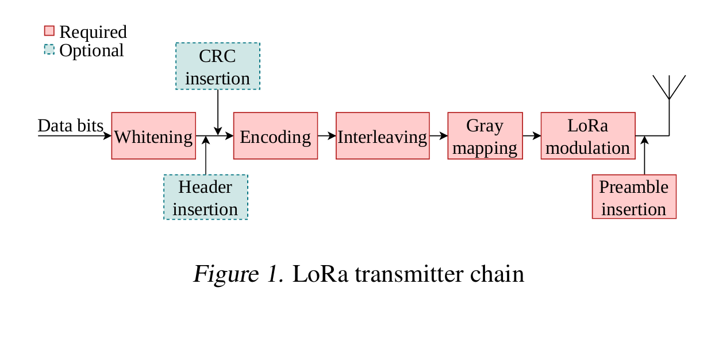

---

### 2.1. Whitening

The transmitter chain starts with a whitening operation that is used to randomize the data before encoding, removing any data-specific binary patterns.  

The whitening operation consists of an XOR operation between the data and a pseudo-random sequence.  

As proposed in (Xu et al., 2023), the pseudo-random sequence can be generated by a **linear feedback shift register (LFSR)** with feedback polynomial:

$$
x^8 + x^6 + x^5 + x^4 + 1
$$

For each step of the LFSR, one byte of the pseudo-random sequence is generated.

Each input byte **D = [D0 … D7]**, represented with right-MSB, is whitened as illustrated in Figure 2.  

After whitening, each byte is split into **nibbles**, where the low nibble is first and the high nibble is second.

---

### Figure 2. Whitening Operation on One Byte of Data

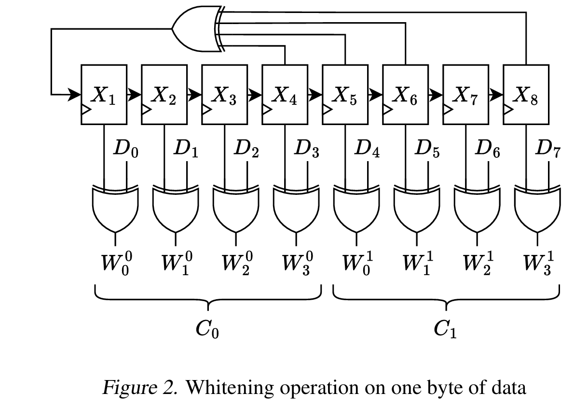

---

### 2.2. PHY Header

The PHY header is an optional field that carries information necessary to decode the frame:  
- Payload length  
- CRC presence flag  
- Code rate  
- Header checksum  

The structure of the five codewords composing the header is illustrated in **Figure 3**.

Contrary to the payload, the nibbles in the header are ordered **high nibble first**.

The header checksum \( h_c \) is computed as:

$$
h_c = G \cdot h
$$

where \( h = [L7, L6, …, C]^T \) and **G** is the generator matrix:

$$
G =
\begin{bmatrix}
1 & 1 & 1 & 1 & 0 & 0 & 0 & 0 & 0 & 0 & 0 & 0\\
1 & 0 & 0 & 0 & 1 & 1 & 1 & 0 & 0 & 0 & 0 & 1\\
0 & 1 & 0 & 0 & 1 & 0 & 0 & 1 & 1 & 0 & 1 & 0\\
0 & 0 & 1 & 0 & 0 & 1 & 0 & 1 & 0 & 1 & 1 & 1\\
0 & 0 & 0 & 1 & 0 & 0 & 1 & 0 & 1 & 1 & 1 & 1
\end{bmatrix}
$$

The presence of the header is **optional**; if all parameters are known by the receiver, the transmission can omit it (**implicit header mode**).

---

### Figure 3. Explicit Header Structure
Where:
- **L** = payload length in bytes  
- **C** = CRC flag  
- **P** = number of parity bits  
- **H** = header checksum  

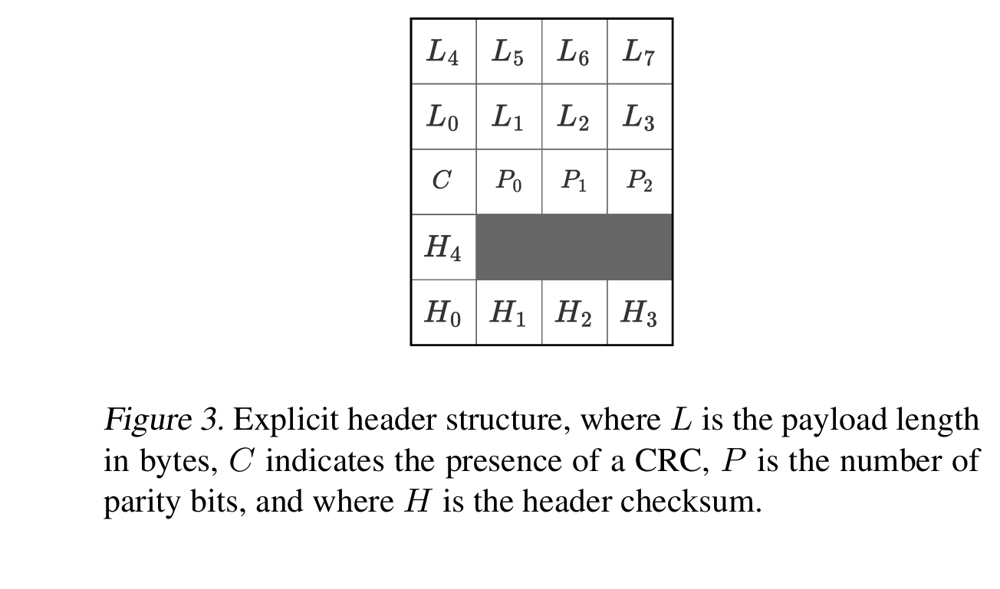

---

### 2.3. Payload CRC

An optional CRC (2 bytes) is computed **only over the payload** to verify data integrity.

Polynomial:  
$$
x^{16} + x^{12} + x^5 + 1
$$

The **last two bytes of the payload are XORed with the CRC output** instead of being included in the CRC input.

---

### 2.4. Encoding

LoRa defines the number of parity bits \( P \in \{1, 2, 3, 4\} \), corresponding to code rates:

$$
CR = \frac{4}{4+P}
$$

The code parameters (8,4)–(6,4) are based on Hamming codes (cropped for parity bits), while (5,4) corresponds to a simple checksum.

Encoding:

$$
c =
\begin{cases}
w \cdot G_0, & P=1 \\
w \cdot G_1, & \text{otherwise}
\end{cases}
$$

where:

$$
G_0 =
\begin{bmatrix}
1 & 0 & 0 & 0 & 1\\
0 & 1 & 0 & 0 & 1\\
0 & 0 & 1 & 0 & 1\\
0 & 0 & 0 & 1 & 1
\end{bmatrix},
\quad
G_1 =
\begin{bmatrix}
1 & 0 & 0 & 0 & 1 & 0 & 1 & 1\\
0 & 1 & 0 & 0 & 1 & 1 & 1 & 0\\
0 & 0 & 1 & 0 & 1 & 1 & 0 & 1\\
0 & 0 & 0 & 1 & 0 & 1 & 1 & 1
\end{bmatrix}
$$

For \( P < 4 \), crop to the first \(4 + P\) bits.

---

### 2.5. Interleaving

Bits are interleaved using a **diagonal block interleaver** to spread each codeword over multiple symbols.

Interleaver size:
- **Input:** \( D_{SF×(4+P)} \)
- **Output:** \( I_{(4+P)×SF} \)

Mapping rule:

$$
I_{i,j} = D\big((i - (j + 1)) \bmod SF,\, i\big)
$$

LoRa also defines a **Low Data Rate Optimization (LDRO)** mode that uses \( (SF - 2) × (4+P) \).

After interleaving:
- Append **1 parity bit** (XOR of bits)
- Append **1 zero bit**

See **Figure 4**.

---

### Figure 4. Interleaving Example for SF=7, P=2

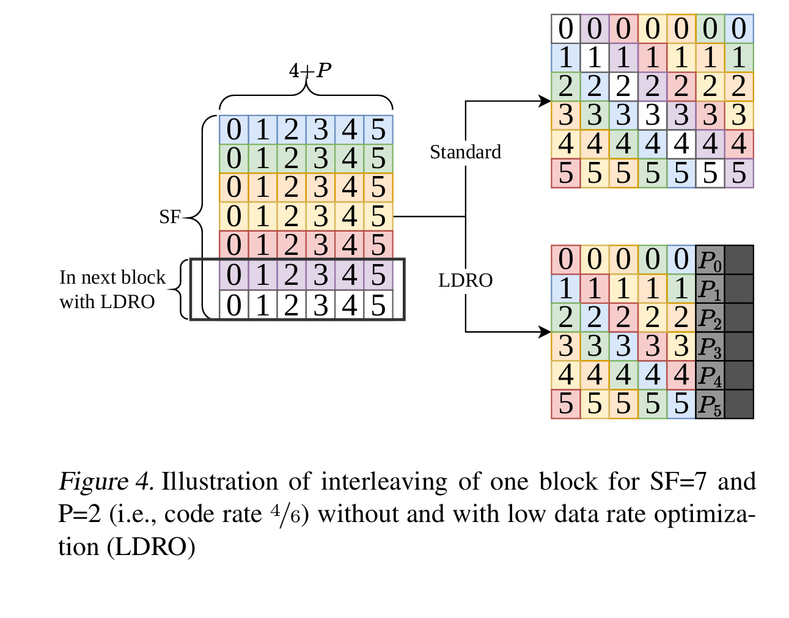

---

### 2.6. Gray Mapping

Each interleaved row is interpreted as Gray-coded binary and converted to a symbol index:

$$
s = \big(I_i \oplus (I_i \gg 1) + 1\big) \bmod SF
$$

This ensures adjacent symbols differ by only one bit, reducing error impact.

---

### 2.7. Fixed Parameters for First Interleaver Block

To decode the header (which defines frame parameters), the **first interleaver block** always uses a fixed, robust configuration:
- **Code rate = 4/8**
- **LDRO enabled when \(SF > 6\)**
- **LDRO disabled for \(SF \in \{5,6\}\)** so the entire explicit header fits inside the first block

Even in implicit header mode (i.e., when the header is not transmitted), the transmitter still encodes the first interleaver block with these parameters so that the receiver can recover the metadata reliably.

---

### 2.8. LoRa Modulation

LoRa uses **Chirp Spread Spectrum (CSS)** with \( N = 2^{SF} \) chips per symbol and symbol duration \( T_s = N / B \). Each symbol is a linear upchirp that sweeps the full signal bandwidth. The symbol value \( s \in \{0, \ldots, N-1\} \) controls the initial frequency offset, and the instantaneous frequency folds back to \(-B/2\) once it reaches \(+B/2\).

When the signal is sampled at \( f_s \), the fold occurs at sample index
$$
n_{\text{fold}} = (N - s)\,\frac{f_s}{B}.
$$
The complex baseband representation of symbol \( s \) can therefore be written as
$$
x_s[n]
 = \exp\!\left(
    j 2\pi \left[
      \frac{n^2}{2N}\left(\frac{B}{f_s}\right)^2
      + \left(\frac{s}{N} - \frac{1}{2} - u\!\left[n-n_{\text{fold}}\right]\right)
        \frac{B}{f_s}\, n
    \right]
  \right),
$$
where \(u[\cdot]\) denotes the unit-step function and \(n \in \{0, \ldots, N f_s/B - 1\}\). Downchirps are obtained by taking the complex conjugate of the upchirps \(x_s[n]\); LoRaWAN typically uses upchirps for the uplink and downchirps for the downlink.

---

### Figure 5. Spectrogram of LoRa Symbols Delimited by Red Dashed Lines

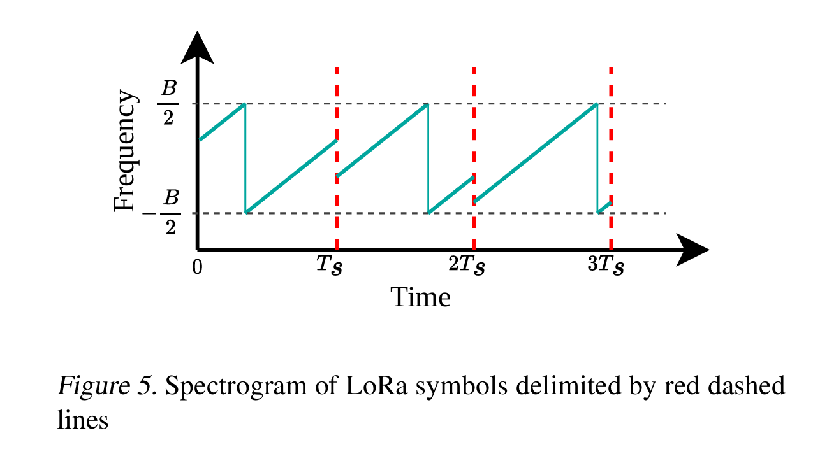

---

### 2.9. Preamble

The frame begins with a preamble that enables coarse synchronization. It contains:

- \(N_{\text{up}}\) repetitions of the reference upchirp \(x_0\) (typically \(N_{\text{up}} = 8\), configurable from 6 to 65,535)
- Two modulated symbols that encode the sync word
- Two and a quarter downchirps (complex conjugates of \(x_0\))

The sync word \(S_w \in [0x10, 0xFF]\) identifies the network (0x34 for LoRaWAN, 0x12 for many private networks). Its two symbol values are
$$
S_{w,0} = (S_w \gg 4) \cdot 8, \qquad S_{w,1} = (S_w \,\&\, 0x0F) \cdot 8.
$$

The total number of symbols in a frame is
$$
\begin{aligned}
N_s &= (4.25 + N_{\text{up}}) \\
&\quad + \left[\,8 + \left\lceil \frac{2D - SF + 4C + 5H + 2\,u(SF-7)}{SF - 2L} \right\rceil \right](4 + P),
\end{aligned}
$$
where:
- \(D\) is the payload length in bytes,
- \(C \in \{0,1\}\) indicates whether a payload CRC is present,
- \(H \in \{0,1\}\) indicates explicit (\(H=1\)) or implicit (\(H=0\)) header mode,
- \(L \in \{0,1\}\) indicates whether LDRO is active,
- \(u(\cdot)\) is the unit-step function.

The first term accounts for the preamble (4.25 downchirps plus \(N_{\text{up}}\) upchirps), whereas the bracketed quantity yields the number of payload symbol groups, encompassing the fixed first interleaver block and any additional payload blocks. The frame duration then follows from \(T_{\text{frame}} = N_s \, 2^{SF}/B\).

---

### Figure 6. Spectrogram of the LoRa Preamble

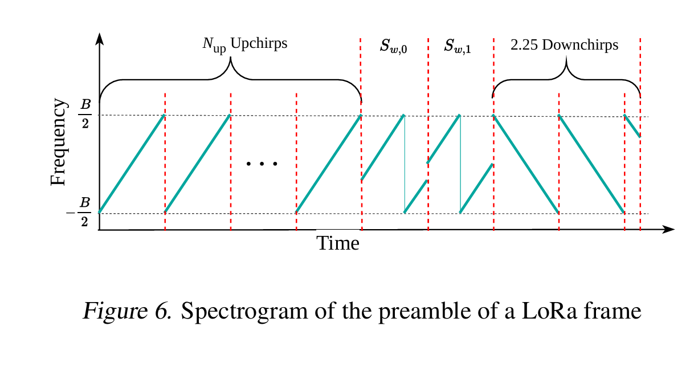

---

## 3. LoRa Frame Detection

The receiver mirrors each processing step of the transmitter to recover the payload reliably. Figure 7 summarizes the chain: whitening removal, synchronization, dechirping and FFT-based demodulation, Gray demapping, deinterleaving, decoding, header extraction, and CRC verification. The following sections detail the key algorithms.

---

### Figure 7. LoRa Receiver Chain

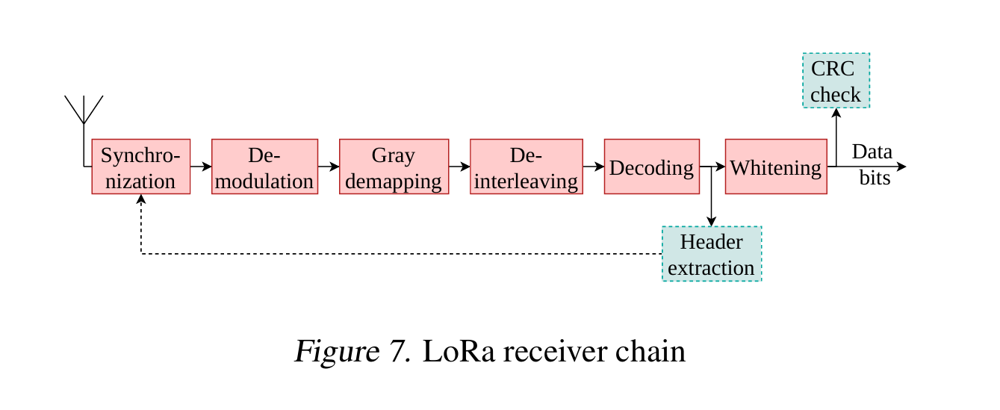

---

### 3.1. Demodulation

LoRa symbols can be demodulated efficiently by exploiting the structure of the chirps. For each received symbol \(y_l\):

1. **Dechirp** by multiplying with the conjugate of the reference upchirp \(x_0\).
2. **Compute the discrete Fourier transform (DFT)** of the dechirped samples; each bin corresponds to a candidate symbol value.

Formally, the maximum-correlation decision rule
$$
\hat{s}_l = \arg\max_{s \in \{0,\ldots,2^{SF}-1\}} \left|\mathrm{corr}(y_l, x_s)\right|
$$
reduces to
$$
\tilde{Y}_l = \mathrm{DFT}\left(y_l \odot x_0^{*}\right), \qquad
\hat{s}_l = \arg\max_k |\tilde{Y}_l[k]|.
$$
Using the FFT to compute \(\tilde{Y}_l\) yields all correlations simultaneously with low complexity.

---

### 3.2. Frame Synchronization

The receiver must detect the frame start and compensate hardware impairments such as sampling-time offsets (STO), carrier-frequency offsets (CFO), and sampling-frequency offsets (SFO). Figures 8 and 9 illustrate how these impairments distort the chirp spectrum.

---

### Figure 8. Effects of CFO and STO on the LoRa Spectrum

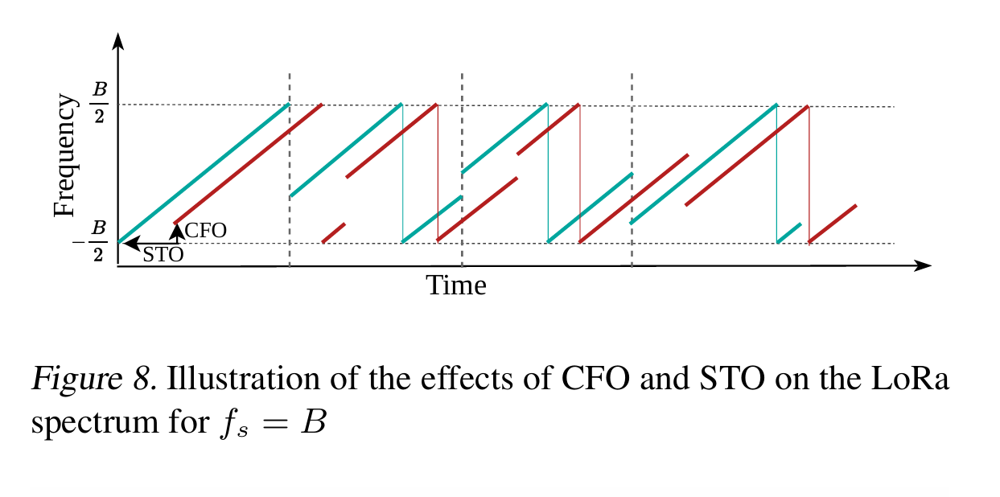

---

### Figure 9. Impact of Integer and Fractional CFO on FFT Magnitude

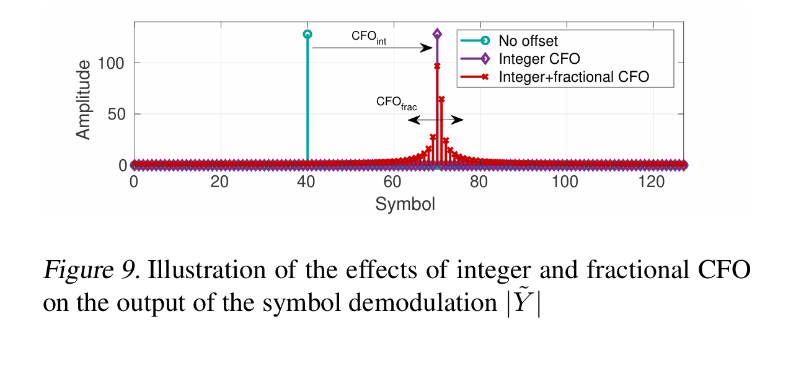

---

#### 3.2.1. Preamble Detection

Reception begins by demodulating symbols from an arbitrary time offset. The preamble contains repeated upchirps whose demodulated values repeat (within a ±1 symbol tolerance) even in the presence of CFO/STO. Once repetitions are detected, the receiver performs a rough synchronization by circularly shifting the input samples so that the repeated symbols map to zero, assuming only STO is present. This coarse step is required before estimating finer offsets.

#### 3.2.2. Offset Estimation and Compensation

Offsets are decomposed into integer and fractional components,
$$
\Delta f_c = \frac{B}{N}(L_{\text{CFO}} + \lambda_{\text{CFO}}), \qquad
\tau = \frac{L_{\text{STO}} + \lambda_{\text{STO}}}{B},
$$
with \(L_{\bullet} \in \mathbb{Z}\) and \(\lambda_{\bullet} \in [-0.5, 0.5)\).

**Fractional CFO.** The estimator of Bernier et al. (2020) and Xhonneux et al. (2022) uses the phase rotation between consecutive upchirps:
$$
\hat{\lambda}_{\text{CFO}}
  = \frac{1}{2\pi}
    \angle\!\left(
      \sum_{l=2}^{N_{\text{up}}}
      \sum_{p=-2}^{2}
      \tilde{Y}_l[i+p] \,
      \tilde{Y}_{l-1}[i+p]
    \right),
$$
where \(i = \arg\max_k |\tilde{Y}_l[k]|\). Compensation multiplies incoming samples by
$$
y'[n] = y[n] \exp\left(-j 2\pi \hat{\lambda}_{\text{CFO}} \frac{B}{N f_s} n\right).
$$

**Fractional STO.** After CFO compensation, the dechirped signal is a pure tone that may fall between FFT bins due to fractional STO. Using the rational-combination estimator of Yang & Wei (2011),
$$
\hat{\lambda}_{\text{STO}} = \frac{N}{2\pi} \frac{P[i+1] - P[i-1]}{a\,\big(P[i+1] + P[i-1]\big) + b\,P[i]},
$$
with
$$
P[k] = \sum_{l=1}^{N_{\text{up}}} \left|\mathrm{DFT}_{2^{SF}}\!\left(y_l \odot x_0^{*}\right)[k]\right|^2,
$$
and coefficients \(a = 64/(5\pi^5 + 32\pi^3)\) and \(b = a\,\pi^2/4\) as defined in that estimator.
The receiver oversamples by \(f_s/B\), circularly shifts the stream by \(\lceil (f_s/B)\hat{\lambda}_{\text{STO}}\rceil\), and resamples back to the original rate to remove the fractional delay.

**Integer CFO and STO.** The final downchirps in the preamble experience opposite shifts to the upchirps. If \(s_{\text{up}}\) and \(s_{\text{down}}\) denote the demodulated values of the last upchirp and the first downchirp, respectively,
$$
\hat{L}_{\text{CFO}} = \frac{1}{2} \Gamma_N\left[(s_{\text{up}} + s_{\text{down}}) \bmod N\right], \qquad
\hat{L}_{\text{STO}} = (s_{\text{up}} - \hat{L}_{\text{CFO}}) \bmod N,
$$
where \(\Gamma_N[k] = k - N \, u(k - N/2)\). Compensation reuses the complex exponential above and circularly shifts the samples by \(\hat{L}_{\text{STO}}\).

**Sampling-Frequency Offset.** A residual SFO causes the STO to drift linearly over long frames. Using the relation between RF and sampling oscillators,
$$
\hat{\Delta f_s} = \hat{\Delta f_c} \frac{f_s}{f_c},
$$
the receiver periodically drops or duplicates a sample every \(\lfloor B / (2\hat{\Delta f_s}) \rfloor\) samples to keep the accumulated STO below half a chip.

After these steps, the remaining samples in the frame are corrected for the dominant impairments before demodulation.

---

## 3.3. Frame Decoding

Each transmitter block has a corresponding receiver counterpart.

### Hard-Decision Decoding
Syndrome:
$$
S = c \cdot H_P^T
$$
where \(H_P\) is composed of the first \(P\) rows and \(4+P\) columns of \(H\).

Matrix:
$$
H =
\begin{bmatrix}
1&1&1&0&1&0&0&0\\
0&1&1&1&0&1&0&0\\
1&1&0&1&0&0&1&0\\
1&1&1&1&1&1&1&1
\end{bmatrix}
$$

| Code rate | Detectable | Correctable |
|------------|-------------|-------------|
| 4/5 | 1 | 0 |
| 4/6 | 2 | 0 |
| 4/7 | 1 | 1 |
| 4/8 | 2 | 1 |

### Soft-Decision Decoding
Compute log-likelihood ratio (LLR):

$$
I_l[m] = \max_{s̄:g_m(s̄)=1}\left[\log I_0\left(\sqrt{\frac{P}{\sigma^2}}|\tilde{Y}_l[s̄]|\right)\right]
- \max_{s̄:g_m(s̄)=0}\left[\log I_0\left(\sqrt{\frac{P}{\sigma^2}}|\tilde{Y}_l[s̄]|\right)\right]
$$

Then deinterleave and decode with a soft-input decoder (Müller et al., 2011).

---

## 4. Implementation and Results

All features described above are implemented as GNU Radio blocks in the out-of-tree module **gr-lora_sdr**. Figure 10 shows the reference flowgraphs for transmission and reception: modular blocks implement whitening, interleaving, modulation/demodulation, and decoding.

### Figure 10. GNU Radio Flowgraph for the LoRa Transmitter (Top) and Receiver (Bottom)

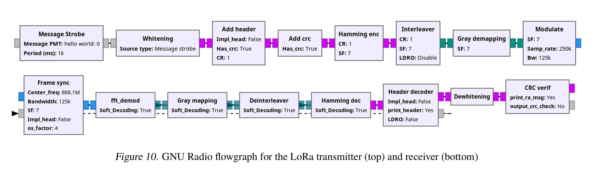

Each flowgraph is a synchronous data-flow graph that processes tagged chunks of samples. Because LoRa transmits discrete frames, two tags are attached to every burst: one at the frame start (carrying metadata such as SF, bandwidth, and sync word) and one at the end of the first interleaver block. The synchronization block buffers samples until the header has been decoded. Once available, the header content is sent back asynchronously to the synchronization block, which augments the downstream tags so that each subsequent block knows the payload configuration.

---

## 4.2. Results

- **AWGN simulations (SF = 7):** Using the GNU Radio blocks, we evaluate frames with 16-byte payloads. Soft-decision decoding of the \((6,4)\) code achieves the same frame-error rate (FER) as hard-decision decoding of the \((8,4)\) code while transmitting ~25% fewer bits.
- **USRP measurements:** Two NI-2920 USRPs exchange frames through a coaxial cable so that the channel closely matches AWGN but still exhibits realistic CFO and STO. The measured FER stays within 1 dB of the simulated curves, validating the synchronization strategy and the overall implementation.

---

### Figure 11. Frame Error Rate for SF7 in AWGN Using Hard and Soft Decoding

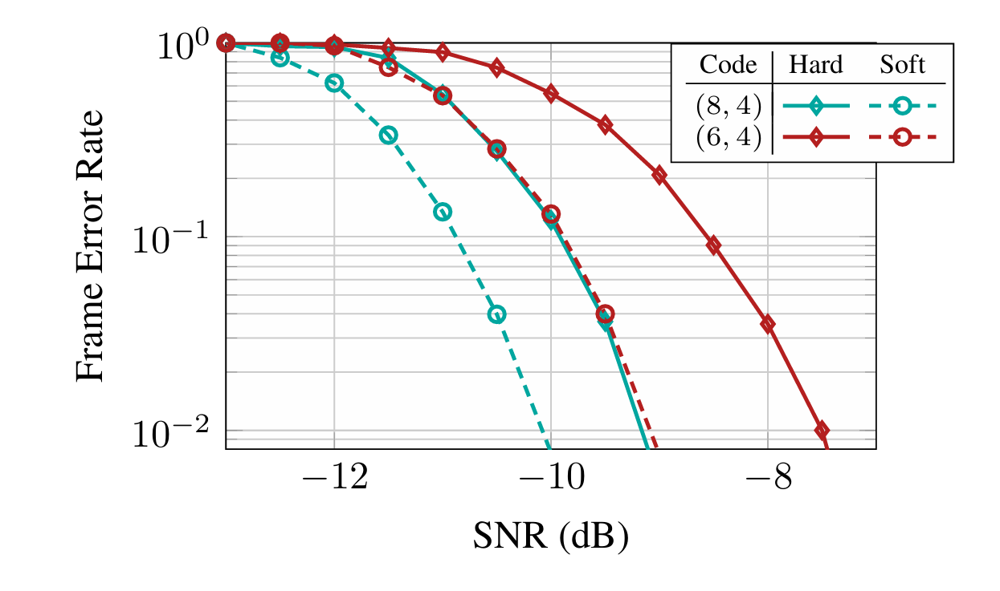

---

### Figure 12. Frame Error Rate for SF7 & SF9, Soft-Decoding

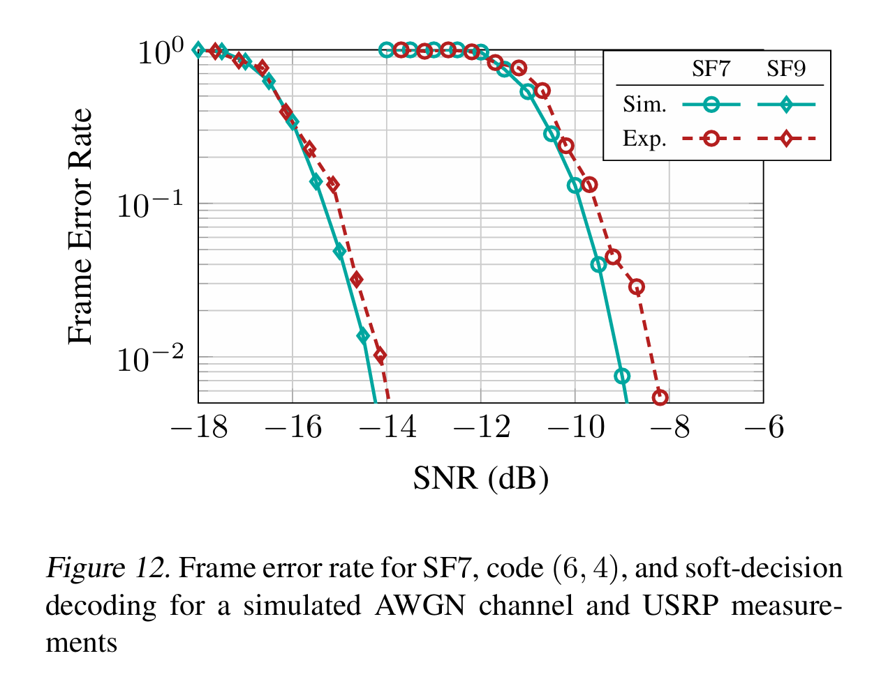

- Shows excellent match between **Simulation (Sim.)** and **Experiment (Exp.)**, with <1 dB degradation in hardware.

---

## 5. Conclusion

This paper presented the modulation and coding scheme of LoRa and detailed the operations necessary to build and detect a LoRa frame compatible with commercial devices.  

We described our open-source GNU Radio LoRa transceiver and presented results from both simulation and real-world experiments.  

Our GNU Radio implementation suffers from only **~1 dB SNR loss** between simulated AWGN and real hardware, despite typical hardware impairments — confirming its accuracy and full commercial compatibility.

---

## References

Afisiadis, O., Cotting, M., Burg, A., & Balatsoukas-Stimming, A. (2019).  
*On the error rate of the LoRa modulation with interference.*  
IEEE Trans. Wirel. Commun., 19(2):1292–1304.

Bernier, C., Dehmas, F., & Deparis, N. (2020).  
*Low complexity LoRa frame synchronization for ultra-low power SDRs.*  
IEEE Trans. Commun., 68(5):3140–3152.

Chiani, M. & Elzanaty, A. (2019).  
*On the LoRa modulation for IoT: Waveform properties and spectral analysis.*  
IEEE Internet Things J., 6(5):8463–8470.

gr-lora_sdr. *A fully-functional GNU Radio LoRa transceiver.*  
GitHub: [https://github.com/tapparelj/gr-lora_sdr](https://github.com/tapparelj/gr-lora_sdr)

Müller, B., Holters, M., & Zölzer, U. (2011).  
*Low complexity soft-input soft-output Hamming decoder.*  
2011 50th FITCE Congress, DOI: 10.1109/FITCE.2011.6133448.

Seller, O.B.A. & Sornin, N. (2016).  
*Low power long range transmitter*, U.S. Patent 9 252 834.

Tapparel, J., Xhonneux, M., Bol, D., Louveaux, J., & Burg, A. (2021).  
*Enhancing the reliability of dense LoRaWAN networks with multi-user receivers.*  
IEEE Open J. Commun. Soc., 2:2725–2738.

Xhonneux, M., Afisiadis, O., Bol, D., & Louveaux, J. (2022).  
*A low-complexity LoRa synchronization algorithm robust to sampling time offsets.*  
IEEE IoT J., 9(5):3756–3769.

Xu, Z., Tong, S., Xie, P., & Wang, J. (2023).  
*From demodulation to decoding: Toward complete LoRa PHY understanding and implementation.*  
ACM Trans. Sen. Netw., 18(4), Jan 2023.

Yang, C. & Wei, G. (2011).  
*A noniterative frequency estimator with rational combination of three spectrum lines.*  
IEEE Trans. Signal Process., 59(10):5065–5070.  
DOI: 10.1109/TSP.2011.2160257.

---

**Proceedings of the 14th GNU Radio Conference, Copyright 2024 by the author(s).**
